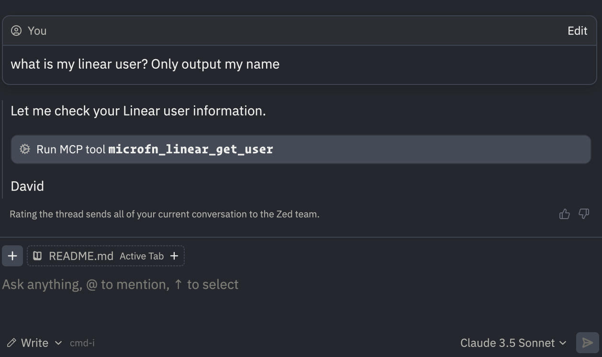

# Linear MCP Server Extension for Zed

This extension integrates [my Linear MCP Server](https://github.com/dvcrn/mcp-server-linear) into Zed's AI Assistant, enabling direct interaction with Linear through Zed.



## Features

- ✨ Full Linear API integration through MCP
- 🔄 Create, update, and manage issues directly from Zed
- 📝 Comment management (create, update, delete, resolve)
- 📊 Project and milestone management
- 👥 Multiple workspace support
- 🔍 Advanced issue search and filtering
- 🏷️ Label management
- 📎 Parent/child issue relationships

## Setup

### Option 1: Developer Token

Go to Linear: Workspace Settings > API > OAuth application > Create or select an application (e.g., "Cline MCP").
Under "Developer Token", click "Create & copy token".
Select "Application" as the actor and copy the generated token.

### Option 2: Personal API Key

Go to Linear: Your Personal Settings > API > Personal API Keys.
Click "Create key", give it a label (e.g., "Cline MCP"), and copy the generated key.

### Setting up Zed

Take the key you just received and add them to your Zed settings.json, in the "context_servers" field

```json
{
  "context_servers": {
    "mcp-server-linear": {
      "settings": {
        "linear_api_key": "<LINEAR_API_KEY>",
        "tool_prefix": "<optional tool prefix>"
      }
    }
  }
}
```

You can also add these keys directly into an Agent profile, for example:

```json
{
  "assistant": {
    "profiles": {
      "write": {
        "name": "Write",
        "context_servers": {
          "mcp-server-linear": {
            "settings": {
              "linear_api_key": "<LINEAR_API_KEY>",
              "tool_prefix": "company1" // optional
            }
          }
        }
      }
    }
  }
}
```

## Multiple Workspace Support

If you work with multiple Linear workspaces, you can use the optional `tool_prefix` setting to prefix all Linear tools. This helps distinguish between different workspaces:

```json
{
  "context_servers": {
    "mcp-server-linear": {
      "settings": {
        "linear_api_key": "<LINEAR_API_KEY>",
        "tool_prefix": "company1"
      }
    }
  }
}
```

With this configuration:

- Tool names will be prefixed (e.g., `company1_linear_create_issue`)
- Makes it clear which workspace each tool is operating on
- Prevents conflicts when working with multiple Linear instances

### Multiple Simultaneous Installations

You can run multiple instances of the MCP server simultaneously by configuring different command blocks with unique `TOOL_PREFIX` values:

```json
{
  "context_servers": {
    "mcp-server-linear": {
      // provided through Zed extension
      "settings": {
        "linear_api_key": "<LINEAR_API_KEY>",
        "tool_prefix": "company1"
      }
    },
    "linear-workspace2": {
      // provided through npx
      "settings": {},
      "command": {
        "command": "npx",
        "args": ["-y", "mcp-server-linear"],
        "env": {
          "LINEAR_ACCESS_TOKEN": "<LINEAR_API_KEY_2>",
          "TOOL_PREFIX": "workspace2"
        }
      }
    }
  }
}
```

Each instance will have its tools prefixed with the specified `TOOL_PREFIX`, allowing you to interact with multiple Linear workspaces simultaneously.
